# Fluxline

**AI-assisted software delivery, running on your own machine with Podman or Docker.**

Describe a change, or pull it straight from Jira, and Fluxline reviews the requirement, plans the
work, has a coding agent (VS Code with Copilot Chat, Claude or Codex) implement it in your
repositories, runs your builds and tests, and stops for your approval before anything is published
as a pull request.

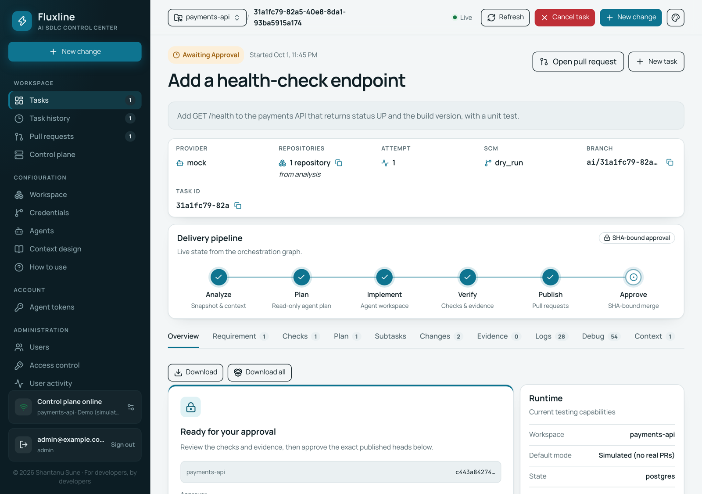

## Start it

One command. It asks for your code folder and, optionally, an Anthropic API key; everything else
is set up for you.

**Podman**

```bash
bash <(curl -fsSL https://raw.githubusercontent.com/shantanusune/fluxline/main/setup-podman.sh)
```

**Docker**

```bash
bash <(curl -fsSL https://raw.githubusercontent.com/shantanusune/fluxline/main/setup-docker.sh)
```

Or clone this repository and run `./setup-podman.sh` or `./setup-docker.sh`.

When it finishes it prints the address and your login:

```text
==> Ready
  Open:         http://localhost:3000
  Sign in:      admin@localhost.com  /  <generated password>
  Coding agent: VS Code, Claude (pick one in + New change)
```

## Walkthrough

From sign-in to an approved change, in the order you'll meet each screen.

### 1. Sign in

Open the address the script printed and sign in with the login it gave you. More people can be
added later under **Administration → Users**.

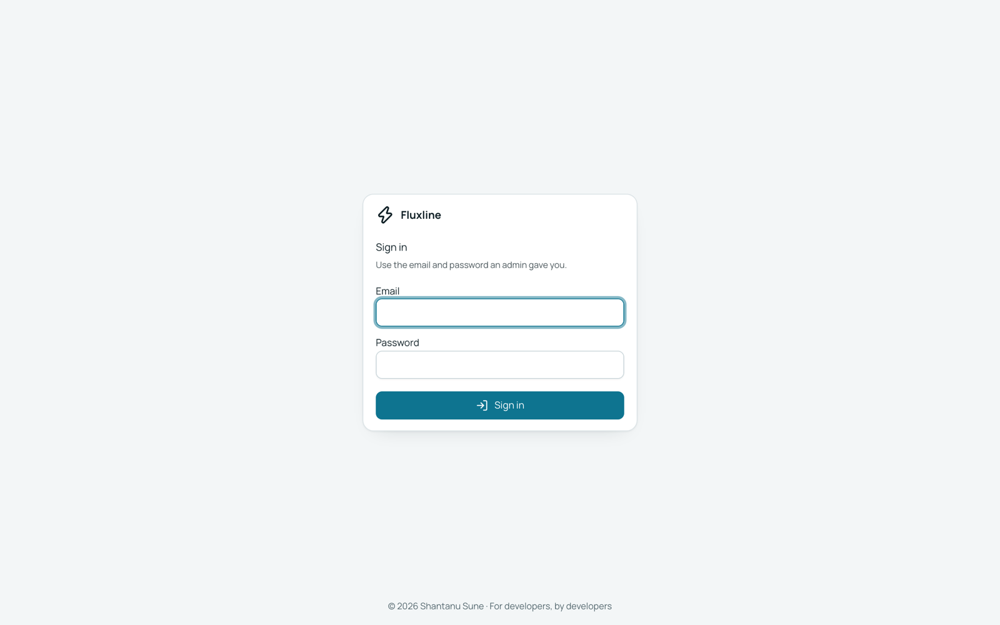

### 2. Your workspace is ready

The folder you gave the script is already the active workspace, shown at the top left. Each
repository inside it is found automatically.

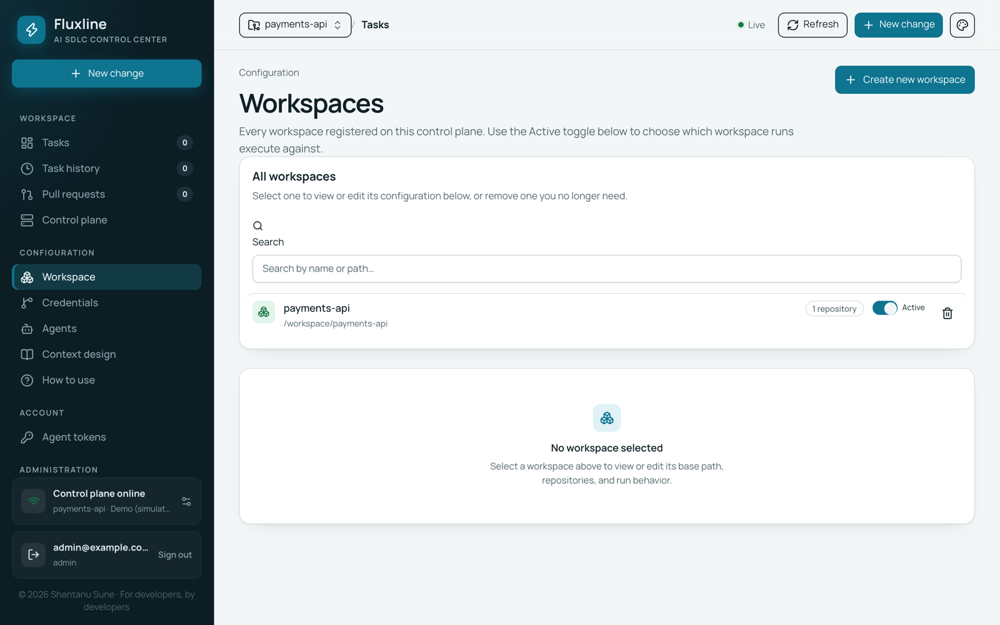

To add another, go to **Configuration → Workspace → Create new workspace** and pick where the code
comes from: a folder the agent can already see, or repositories checked out from GitHub, GitLab or
Bitbucket.

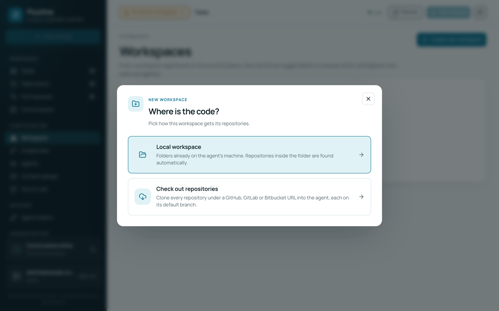

For a local workspace, give it a name and the folder's path, then **Create workspace** and switch it
to **Active**.

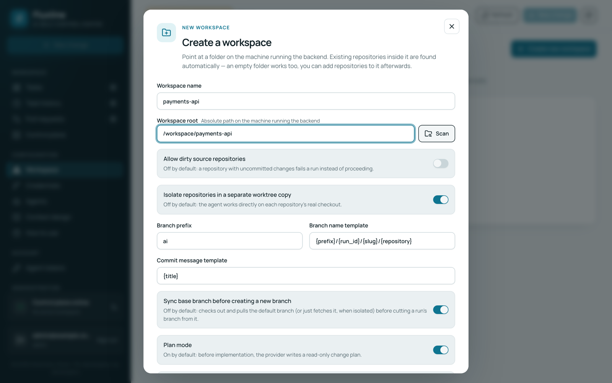

### 3. Add your Git host

Under **Configuration → Credentials**, add a personal access token for GitHub, GitLab or
Bitbucket, then **Test connection** and **Save**. Fluxline uses it to check out repositories and
open pull requests; it picks the token that matches each repository's host. You can do this before
creating any workspace.

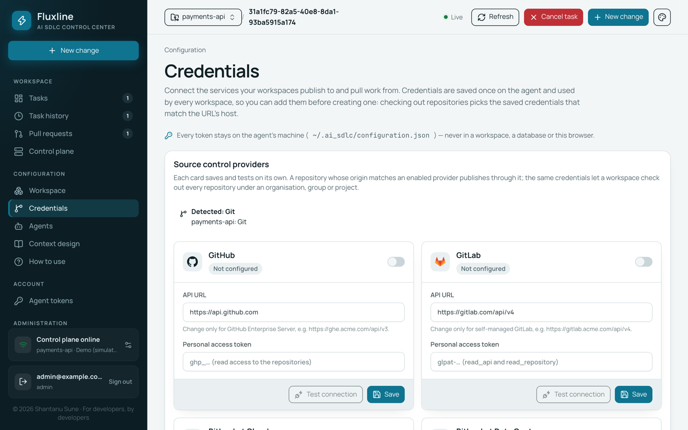

### 4. Choose your coding agent

Under **Configuration → Agents**, switch on the agents you want to use. For Claude or Codex, paste
an API key and **Save**; the agent checks it straight away.

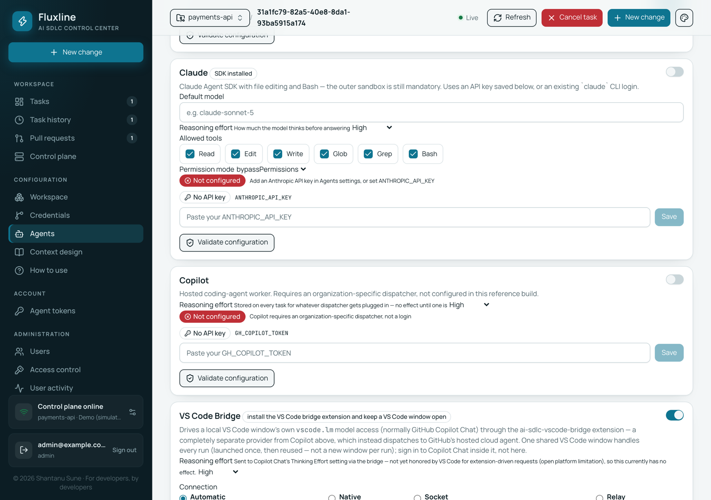

For VS Code, keep a VS Code window open with Copilot Chat signed in. The script installs the
bridge extension, and **Automatic** finds it on its own.

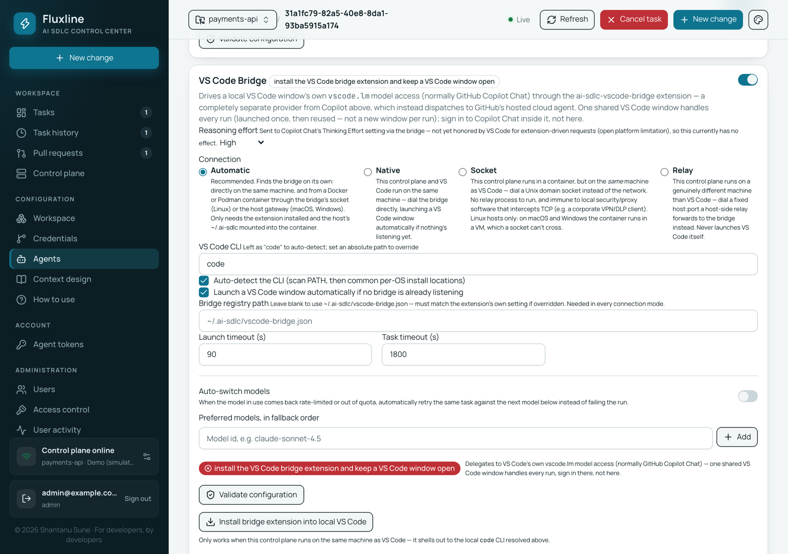

### 5. Shape how the agent works (optional)

**Configuration → Context design** holds reusable instructions for the coding agent. Start from
the built-in ones, upload your own `.md` files, or generate them from your code.

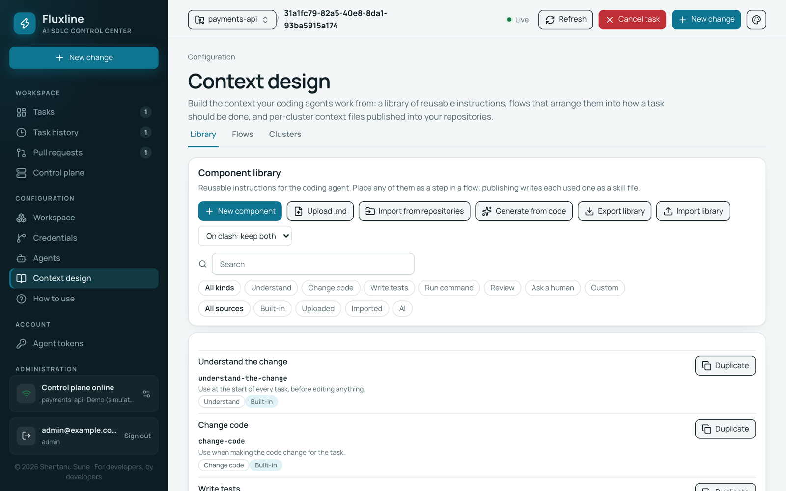

On the **Flows** tab, drag steps onto the canvas and connect them to set the order the agent
follows. Publishing writes them into your repositories as skill files the agent reads.

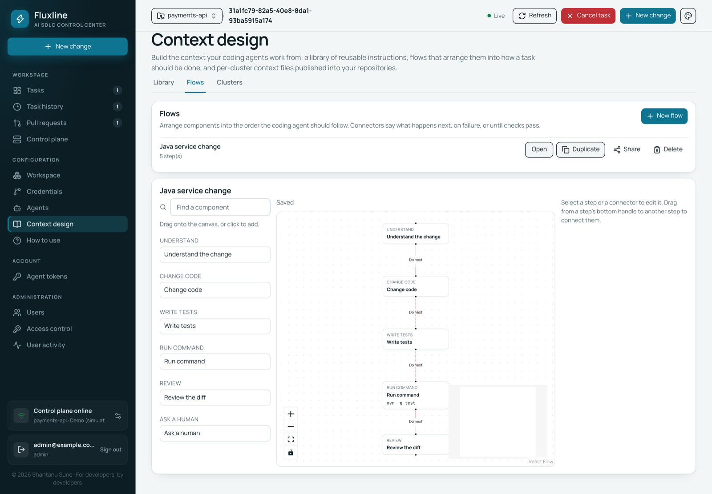

### 6. Start a task

Click **+ New change**. Give it a title, a description and acceptance criteria (one per line),
pick the coding agent under **Provider**, and **Start task**.

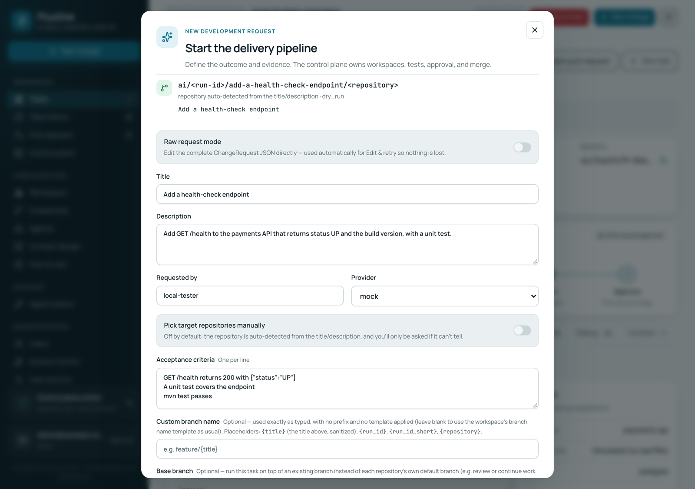

### 7. Review the requirement

Fluxline reads the request against your code, shows the likely impact, and offers clearer
versions. Pick one and **Continue with selected**, or ask for another round with
**Refine & regenerate**.

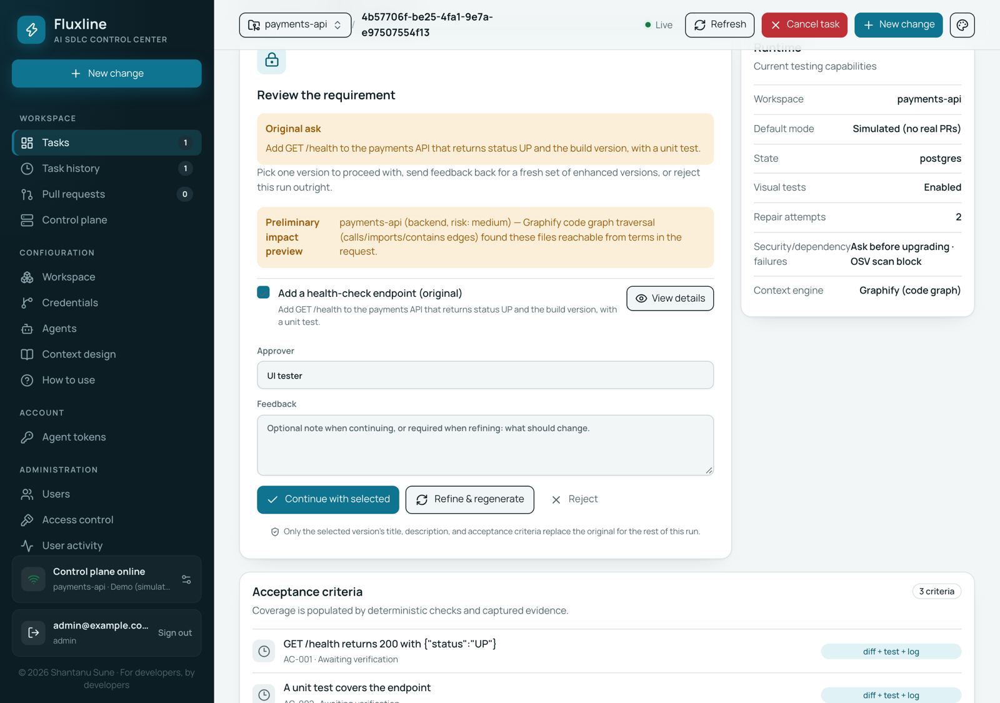

### 8. Follow the pipeline

The task moves through **Analyze → Plan → Implement → Verify → Publish → Approve**. Each tab
shows what happened at that stage, and the Logs tab follows the agent live. **Verify** runs each
repository's tests, found from its build files (`mvn test`, `gradle test`, `npm test`,
`go test`, `cargo test`).


The **Plan** tab holds the agent's change plan. **Download** saves the current tab;
**Download all** saves every stage's artifacts for this task in one archive.

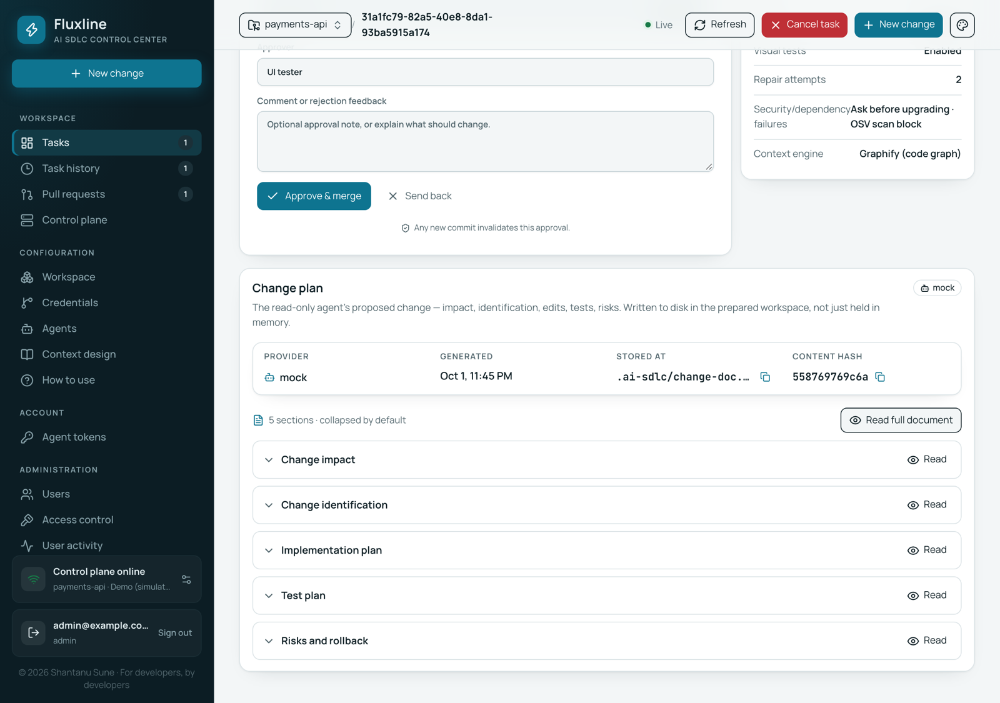

The **Changes** tab lists the changed files per repository. From there you can open the folder,
check the branch out locally or create the pull request.

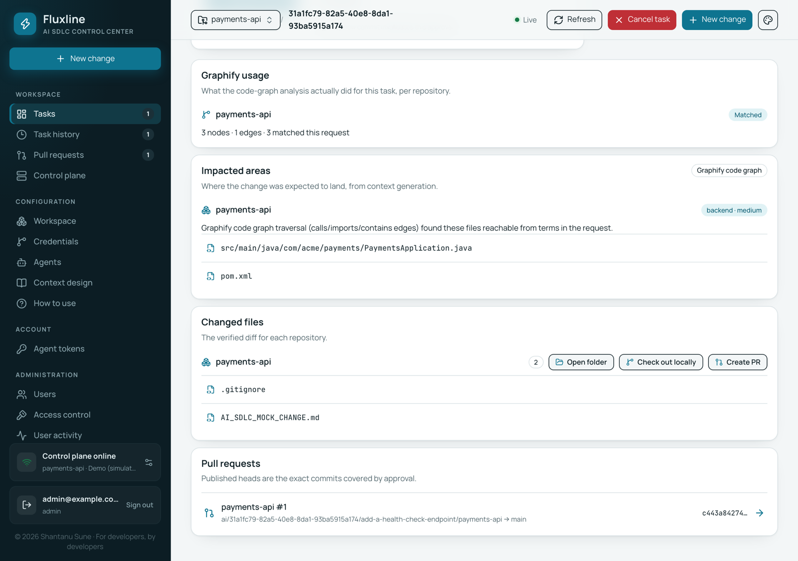

### 9. Approve

When checks pass, the task waits for you. **Approve & merge** approves exactly the commits shown;
any new commit invalidates the approval. **Send back** returns it to the agent with your comment.

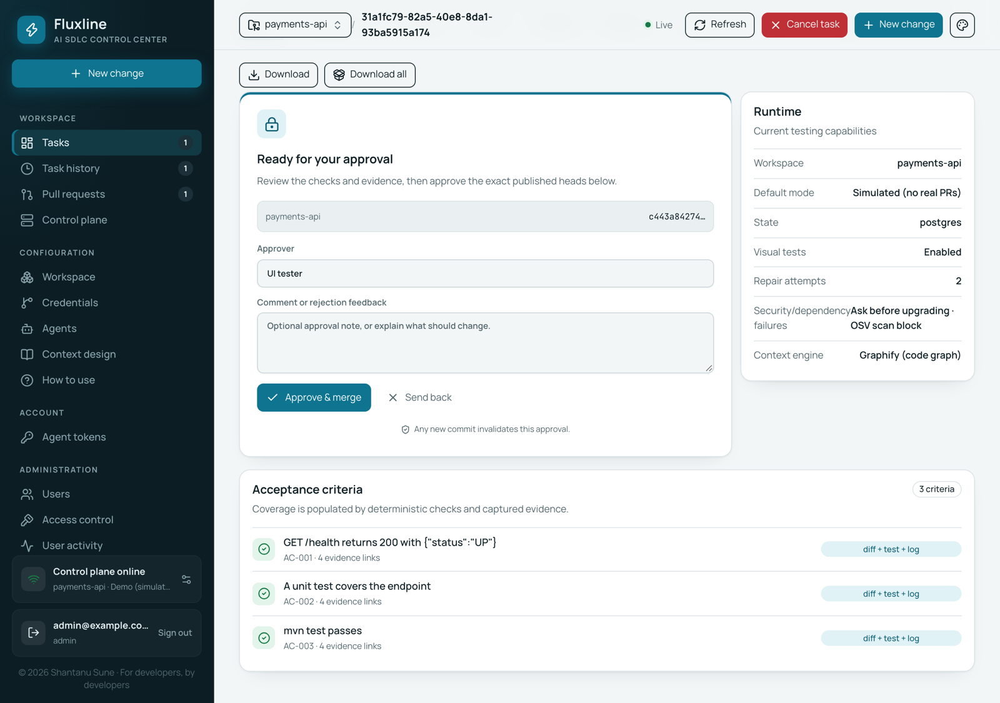

## What the script does

1. **Checks the engine.** For Podman on macOS or Windows it creates and starts a Podman machine if
   there isn't one. On Linux it starts your user's Podman API service.
2. **Asks two questions:** the folder with your code (a repository, or a folder of repositories)
   and an optional Anthropic API key. Press Enter to accept the defaults.
3. **Pulls the images** for your CPU (`arm64` or `amd64`) and starts three containers on a private
   network: Postgres, the agent and the UI.
4. **Signs you up.** Creates the admin account and connects the UI to the agent with a generated
   token.
5. **Sets up build/test containers.** Builds and tests run in their own toolchain containers
   (Maven, Gradle, Node, Go, Python, Rust). The script finds an engine socket the agent can use and
   checks it actually works; if none does, checks run inside the agent instead.
6. **Installs the VS Code bridge extension** when the `code` command is available. The agent
   finds VS Code by itself; reload open VS Code windows once.

Your answers, the database password, the admin password and the agent token are saved in
`~/.fluxline/setup.env` (readable only by you). Running the script again keeps all of them, so it's
also how you update: it pulls the latest images and recreates the containers with the same data.

## Everyday commands

Use `setup-docker.sh` in place of `setup-podman.sh` on Docker.

| Command | What it does |
| --- | --- |
| `./setup-podman.sh` | Set up, or update to the latest images |
| `./setup-podman.sh --yes` | Same, without questions |
| `./setup-podman.sh status` | What's running, and whether the agent reaches the engine |
| `./setup-podman.sh down` | Remove the containers; your data is kept |
| `./setup-podman.sh --remote https://fluxline.example.com` | Run only the agent, linked to a Fluxline UI your team already hosts. It asks for a personal access token from that UI's **Account → Agent tokens**. |
| `podman logs -f fluxline-agent` | Watch the agent work |

To remove everything, including data:

```bash
./setup-podman.sh down
podman volume rm fluxline-db-data fluxline-agent-data
rm ~/.fluxline/setup.env
```

## Coding agents

| Agent | What you need |
| --- | --- |
| **VS Code** (Copilot Chat) | VS Code with GitHub Copilot Chat signed in. The script installs the bridge extension; keep a VS Code window open. |
| **Claude** | An Anthropic API key, entered when the script asks or later under **Configuration → Agents**. On macOS the Claude CLI keeps its login in the Keychain, which containers can't read, so a key is needed. |
| **Codex** | `OPENAI_API_KEY` set before running the script, an API key added under **Configuration → Agents**, or an existing `codex login` (`~/.codex`), picked up automatically. |

Providers you give credentials for are switched on automatically. Keys saved in the app are kept on the agent's data volume, so they survive updates.

## Options

Set any of these before running the script, for example
`UI_PORT=3100 ./setup-podman.sh`.

| Variable | Default | What it's for |
| --- | --- | --- |
| `UI_PORT` / `AGENT_PORT` | `3000` / `3400` | Host ports. |
| `ADMIN_EMAIL` / `ADMIN_PASSWORD` | `admin@localhost.com` / generated | The first admin account. |
| `ANTHROPIC_API_KEY` / `OPENAI_API_KEY` | none | Coding agent credentials, without being asked. |
| `FLUXLINE_REGISTRY` | `docker.io/suneshantanu` | Pull the Fluxline images from another registry, such as a mirror. `DB_IMAGE` does the same for Postgres. |
| `FLUXLINE_TOOLCHAIN=0` | on | Never give the agent the engine socket; checks run inside the agent. |
| `FLUXLINE_VSCODE=0` | on | Don't install the VS Code bridge extension. |
| `FLUXLINE_NAME` | `fluxline` | Prefix for containers, network and volumes, to run a second, separate stack. |

## Behind a proxy

Fluxline works behind an HTTP proxy. The containers use your proxy settings for internet access
(Podman passes them on automatically; with Docker, set them in Docker Desktop under
**Settings → Resources → Proxies**). Connections between Fluxline and VS Code on your machine never
go through the proxy.

If image pulls are blocked, pull from a mirror instead:

```bash
FLUXLINE_REGISTRY=registry.example.com/fluxline DB_IMAGE=registry.example.com/postgres:17-alpine ./setup-podman.sh
```

## Podman notes

- Runs rootless: nothing uses `sudo`, containers run as your own user, and files the agent writes in
  your repositories belong to you.
- On SELinux systems (Fedora, RHEL) your folders are never relabelled.
- On macOS the Podman machine only sees your home folder, so keep your code under it.
- The engine socket the agent gets grants nothing beyond what your own user can do. With Docker it
  gives root access to that machine; set `FLUXLINE_TOOLCHAIN=0` to leave it out.

## What's mounted into the agent

| Host | In the agent | Why |
| --- | --- | --- |
| Your code folder | same path | The repositories it works on; paths in the UI and logs match your machine. |
| `~/fluxline-repos` | `/repos` | Where **Check out repositories** clones land. |
| `~/.ai-sdlc` | `/root/.ai-sdlc` | How the agent finds the VS Code bridge. |
| `~/.fluxline/runs` | same path | Each task's working copy, where VS Code can edit it. |
| `~/.gitconfig`, `~/.ssh` | read-only | Your commit identity and SSH keys, if present. |
| `~/.codex` | `/root/.codex` | An existing Codex login, if present. |
| The engine socket | `/var/run/docker.sock` | Build/test toolchain containers. |

## Troubleshooting

| Symptom | Fix |
| --- | --- |
| `status` says the agent can't reach the engine | Re-run the script; it re-checks the sockets. On Linux with Podman: `systemctl --user enable --now podman.socket`. |
| VS Code isn't listed as available | Open VS Code (the bridge starts with it), then use **Validate** on the VS Code card under **Configuration → Agents** in the UI. |
| `Couldn't pull …` | Pull from a mirror: set `FLUXLINE_REGISTRY` and `DB_IMAGE` (see [Behind a proxy](#behind-a-proxy)). |
| `The fluxline-db-data volume exists but its password isn't in …` | `~/.fluxline/setup.env` was removed. Restore it, or start fresh with `podman volume rm fluxline-db-data`. |
| A port is already in use | `UI_PORT=3100 AGENT_PORT=3500 ./setup-podman.sh` |

## Images

| Image | What it runs | Tags |
| --- | --- | --- |
| [`suneshantanu/fluxline-ui`](https://hub.docker.com/r/suneshantanu/fluxline-ui) | The web app: tasks, approvals, Jira, settings, users | `arm64`, `amd64` |
| [`suneshantanu/fluxline-agent`](https://hub.docker.com/r/suneshantanu/fluxline-agent) | The pipeline: requirement review, planning, coding agent, checks, pull requests | `arm64`, `amd64` |

The script picks the tag for your machine.

## License

MIT, see [LICENSE](LICENSE).

---

© 2026 Shantanu Sune · For developers, by developers
