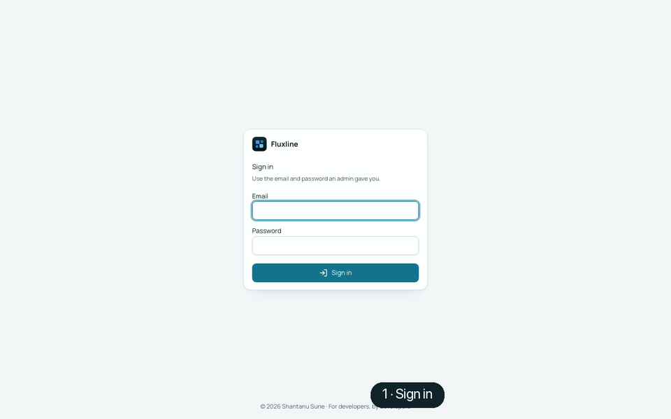

# Fluxline

**AI-assisted software delivery, running on your own machine with Podman or Docker.**

Describe a change, or pull it straight from Jira, and Fluxline reviews the requirement, plans the
work, has a coding agent (VS Code with Copilot Chat, Claude or Codex) implement it in your
repositories, runs your builds and tests, and stops for your approval before anything is published
as a pull request.



## Start it

You need [Docker Desktop](https://www.docker.com/products/docker-desktop/) or
[Podman](https://podman-desktop.io/downloads) installed. Then use the Fluxline app (easiest) or the
one-line script.

### The app

Download it for your computer. It includes everything it needs (Java included); there is nothing
to install.

| Computer | Download |
| --- | --- |
| macOS, Apple Silicon (M1–M4) | [Fluxline-macos-arm64.zip](https://github.com/shantanusune/fluxline/releases/latest/download/Fluxline-macos-arm64.zip) |
| macOS, Intel | [Fluxline-macos-x64.zip](https://github.com/shantanusune/fluxline/releases/latest/download/Fluxline-macos-x64.zip) |
| Windows, x64 | [Fluxline-windows-x64.zip](https://github.com/shantanusune/fluxline/releases/latest/download/Fluxline-windows-x64.zip) |
| Linux, x64 | [Fluxline-linux-x64.tar.gz](https://github.com/shantanusune/fluxline/releases/latest/download/Fluxline-linux-x64.tar.gz) |
| Linux, ARM | [Fluxline-linux-arm64.tar.gz](https://github.com/shantanusune/fluxline/releases/latest/download/Fluxline-linux-arm64.tar.gz) |

All versions: [Releases](https://github.com/shantanusune/fluxline/releases).

Unzip it and open **Fluxline**. The app isn't signed yet, so the first time:

- **macOS:** right-click **Fluxline** → **Open** → **Open**. (Or run
  `xattr -dr com.apple.quarantine Fluxline.app` once.)
- **Windows:** if SmartScreen appears, **More info** → **Run anyway**.
- **Linux:** run `Fluxline/bin/Fluxline`.

It finds Docker or Podman, asks for your code folder and an optional Anthropic API key, shows each
step as it runs, and ends on a dashboard with the address, your login, and Stop, Restart, Logs and
Clean start. It also:

- keeps your terminal's or computer's proxy out of Fluxline (tick **Use this computer's proxy** in
  Advanced options if Fluxline needs it to reach the internet);
- removes invisible characters from pasted keys and folders;
- restarts a Podman machine that says it's running but doesn't answer;
- names any container already using Fluxline's ports, and can stop it for you (**Force stop and
  retry**);
- on private networks and behind proxies that inspect HTTPS, shows the certificate authority the network
  presents and asks before trusting it (see [Behind a proxy](#behind-a-proxy)).

The app and the script share the same settings, container and data, so you can switch between them.

### The script

One command. It asks for your code folder and, optionally, an Anthropic API key; everything else
is set up for you.

**Podman**

```bash
bash <(curl -fsSL https://raw.githubusercontent.com/shantanusune/fluxline/main/setup-podman.sh)
```

**Docker**

```bash
bash <(curl -fsSL https://raw.githubusercontent.com/shantanusune/fluxline/main/setup-docker.sh)
```

Or clone this repository and run `./setup-podman.sh` or `./setup-docker.sh`.

When it finishes it prints the address and your login (the app shows the same on its dashboard):

```text
==> Ready
  Open:         http://localhost:3000
  Sign in:      admin@localhost.com  /  <generated password>
  Coding agent: VS Code, Claude (pick one in + New change)
```

## Walkthrough

The animation at the top shows the whole path. In words:

1. **Sign in** with the address and login the app or the script showed. More people can be added under
   **Administration → Users**.
2. **Create a workspace.** The folder you gave the script is already one. To add another, open
   **Configuration → Workspace → Create new workspace**: a folder the agent can see, or
   repositories checked out from GitHub, GitLab or Bitbucket. Switch it to **Active**.
3. **Turn on a coding agent** under **Configuration → Agents**: VS Code (Copilot Chat), Claude or
   Codex. Paste an API key for Claude or Codex; VS Code is found automatically. **Mock** needs
   nothing and is handy for a first try.
4. **Add your Git host** under **Configuration → Credentials**: a personal access token for
   GitHub, GitLab or Bitbucket, used to check out repositories and open pull requests.
5. **Start a task** with **+ New change**: a title, a description and acceptance criteria.
6. **Review the requirement.** Fluxline reads it against your code and offers clearer versions;
   pick one and continue.
7. **Follow the pipeline**: Analyze → Plan → Implement → Verify → Publish → Approve. Verify runs
   each repository's tests, found from its build files (`mvn test`, `gradle test`, `npm test`,
   `go test`, `cargo test`). Every tab has **Download**, and **Download all** saves every stage's
   artifacts in one archive.
8. **Approve.** **Approve & merge** approves exactly the commits shown; **Send back** returns the
   task to the agent with your comment.

**Context design** (under Configuration) is optional: reusable instructions and a drag-and-drop
flow that publish skill files into your repositories for the coding agent to follow. **Scan
workspace** (Clusters) runs in the background: it groups your repositories by their build files
within seconds, then writes each group's starting instructions. You can leave the page or reload;
after a restart, **Resume** carries on where it stopped.

## What setup does

The app and the script do the same:

1. **Checks the engine.** For Podman on macOS or Windows it creates and starts a Podman machine if
   there isn't one. On Linux it starts your user's Podman API service.
2. **Asks two questions:** the folder with your code (a repository, or a folder of repositories)
   and an optional Anthropic API key. Press Enter to accept the defaults.
3. **Pulls one image**, `fluxline-standalone`, and starts it as one container, `fluxline`, with
   the UI, the agent and its Postgres database inside.
4. **Signs you up.** The first start creates the admin account and connects the UI to the agent.
5. **Sets up build/test containers.** Builds and tests run in their own toolchain containers
   (Maven, Gradle, Node, Go, Python, Rust). The script finds an engine socket the agent can use and
   checks it actually works; if none does, checks run inside the agent instead.
6. **Installs the VS Code bridge extension** when the `code` command is available. The agent
   finds VS Code by itself; reload open VS Code windows once.

Your answers and the admin password are saved in `~/.fluxline/setup.env` (readable only by you).
Running the script again keeps them, so it's also how you update: it pulls the latest image and
recreates the container with the same data.

Coming from the earlier three-container setup (`fluxline-ui`, `fluxline-agent`, `fluxline-db`)?
The script replaces those containers. Their data stays in the old volumes and isn't carried over.

## Everyday commands

Use `setup-docker.sh` in place of `setup-podman.sh` on Docker.

| Command | What it does |
| --- | --- |
| `./setup-podman.sh` | Set up, or update to the latest image |
| `./setup-podman.sh --yes` | Same, without questions |
| `./setup-podman.sh status` | What's running, and whether the agent reaches the engine |
| `./setup-podman.sh down` | Remove the container; your data is kept |
| `./setup-podman.sh --clean` | Start completely fresh: deletes the data (tasks, workspaces, users, saved API keys and Git credentials), the saved login and the task working copies, then sets up again. It lists what it deletes and asks first; add `--yes` to skip the question. Your code folder is never touched. |
| `./setup-podman.sh down --clean` | The same clean-up, without starting again |
| `./setup-podman.sh --remote https://fluxline.example.com` | Run only the agent, linked to a Fluxline UI your team already hosts. It asks for a personal access token from that UI's **Account → Agent tokens**. |
| `podman logs -f fluxline` | Watch Fluxline work |

Every run stops the Fluxline that's already running first (including containers from the earlier
three-container setup), then starts the new one with the same data.

The app takes the same commands from a terminal (useful on servers):

| macOS | Windows | Linux |
| --- | --- | --- |
| `Fluxline.app/Contents/MacOS/Fluxline status` | `Fluxline\fluxline-cli.exe status` | `Fluxline/bin/Fluxline status` |

with `up`, `status`, `down`, `--clean`, `--yes`, `--remote <address>`, plus `--force` (stop other
containers using Fluxline's ports) and `--use-proxy`. `--help` lists them all.

## Coding agents

| Agent | What you need |
| --- | --- |
| **VS Code** (Copilot Chat) | VS Code with GitHub Copilot Chat signed in. The script installs the bridge extension; keep a VS Code window open. With **Auto-switch models** on (VS Code card), a busy or rate-limited model hands the task to the next one, and if all are busy the task waits and retries by itself instead of asking you. |
| **Claude** | An Anthropic API key, entered when the script asks or later under **Configuration → Agents**. On macOS the Claude CLI keeps its login in the Keychain, which containers can't read, so a key is needed. |
| **Codex** | `OPENAI_API_KEY` set before running the script, an API key added under **Configuration → Agents**, or an existing `codex login` (`~/.codex`), picked up automatically. |

Providers you give credentials for are switched on automatically. Keys saved in the app are kept on the agent's data volume, so they survive updates.

## Options

Set any of these before running the script, for example
`UI_PORT=3100 ./setup-podman.sh`.

| Variable | Default | What it's for |
| --- | --- | --- |
| `UI_PORT` / `AGENT_PORT` | `3000` / `3400` | Host ports. |
| `ADMIN_EMAIL` / `ADMIN_PASSWORD` | `admin@localhost.com` / generated | The first admin account. |
| `ANTHROPIC_API_KEY` / `OPENAI_API_KEY` | none | Coding agent credentials, without being asked. |
| `FLUXLINE_REGISTRY` | `docker.io/suneshantanu` | Pull the Fluxline image from another registry, such as a mirror. |
| `FLUXLINE_TOOLCHAIN=0` | on | Never give the container the engine socket; checks run inside it. |
| `FLUXLINE_VSCODE=0` | on | Don't install the VS Code bridge extension. |
| `FLUXLINE_NAME` | `fluxline` | Name of the container and prefix of its volumes, to run a second, separate copy. |

### Agent and UI settings

The app's **Advanced options → Fluxline settings…** (or **Settings…** on its dashboard) changes
the agent's and the UI's own settings; each shows its default. They're saved in
`~/.fluxline/container.env`, which the script uses too, and apply when Fluxline next starts
(**Save and apply** restarts it with your data kept). From a terminal: `Fluxline settings` lists
them, `--set KEY=value` changes one, `--unset KEY` returns it to the default.

| Setting | Default | What it's for |
| --- | --- | --- |
| `FLUXLINE_DB_POOL_MAX` | `64` | Database connections the UI and the agent each keep open (2–120). Postgres's own limit grows to fit. |
| `FLUXLINE_PG_MAX_CONNECTIONS` | automatic | Postgres `max_connections`; automatic is both pools + the checkpoint pool + 20. |
| `DB_POOL_IDLE_TIMEOUT_MS`, `DB_POOL_MAX_USES` | 30000, no limit | The UI's pool: idle timeout, queries per connection. |
| `AI_SDLC_DB_POOL_MIN`, `AI_SDLC_DB_POOL_IDLE_TIMEOUT_MS` | 2, 300000 | The agent's pool. |
| `AI_SDLC_DB_CHECKPOINT_POOL_MIN` / `_MAX` | 1 / 10 | The agent's pipeline-state pool. |
| `AI_SDLC_GIT_USER_NAME`, `AI_SDLC_GIT_USER_EMAIL` | from your Git settings | Commit author in task working copies. |
| `AI_SDLC_DEPENDENCY_POLLER_ENABLED`, `_INTERVAL_SECONDS` | on, 60 | Dependency (vulnerability) checks. |
| `AI_SDLC_CLUSTER_SECTION_CONCURRENCY`, `AI_SDLC_CLUSTER_SECTION_TIMEOUT_SECONDS` | 1, 900 | Workspace scan: cluster instructions written at once, time per section. |
| `AI_SDLC_SVN_ENABLED` | off | Workspaces with Subversion repositories. |
| `AI_SDLC_ARTIFACTORY_URL`, `AI_SDLC_ARTIFACTORY_TOKEN` | none | Package mirror for dependency upgrades. |
| `LOCAL_DEV` | on | Turn off when Fluxline is served over HTTPS (secure sign-in cookie). |

Other `KEY=value` settings the agent or the UI read can be added too. Settings Fluxline manages
itself (database address, ports, tokens, paths, proxies, certificates) are refused.

## Behind a proxy

Fluxline works behind an HTTP proxy. Connections between Fluxline and VS Code on your machine never
go through it.

- **The app** keeps proxies out of the container by default, so a proxy set in a terminal can't
  get in Fluxline's way. If Fluxline needs the proxy to reach the internet (coding agents, Git
  hosts, Jira), tick **Use this computer's proxy** in Advanced options (`--use-proxy` on the
  command line).
- **The script** passes the engine's proxy settings on (Podman does so automatically; with Docker,
  set them in Docker Desktop under **Settings → Resources → Proxies**).

Image downloads use the engine's own proxy settings (Docker Desktop, or the Podman machine).

**`x509: certificate signed by unknown authority` while downloading.** Your network re-signs HTTPS
with its own certificate authority, which your computer trusts but the Podman machine and the
Fluxline container don't. The app shows that authority (name, validity, SHA-256 fingerprint) and
asks whether to trust it; check the fingerprint with your network administrator if unsure. Once trusted, it's
added to the Podman machine, used for the download, and given to Fluxline so the coding agents,
Git and Jira work through the same network. It's kept in `~/.fluxline/certs` (Advanced options →
**Trusted certificates** lists and removes them); your computer's own trust settings aren't
changed.

- Already have the authority's file? `--trust-ca network-ca.pem`, or **Add from file…**
  under Trusted certificates.
- Docker Desktop takes extra authorities from your computer's trust: the app tells you the command
  (macOS keychain or Windows certificate store), then restart Docker Desktop.
- Last resort, Podman only: **Skip certificate checks for the image download** (`--insecure-pull`)
  downloads without checking, for that run only.

If image pulls are blocked, pull from a mirror instead:

```bash
FLUXLINE_REGISTRY=registry.example.com/fluxline ./setup-podman.sh
```

## Supported versions

The script checks the engine before starting and tells you if it's too old.

| Engine | Supported | Tested | Older releases |
| --- | --- | --- | --- |
| **Podman** | 5.x and 6.x; 4.9 also works | 4.9, 5.6, 5.8 (Linux, rootless); 5.5, 5.6, 6.1 (macOS) | 4.0–4.8: a warning; 3.x and older: stops with a message |
| **Docker** | 24 and newer | 28 (Docker Desktop, macOS) | 20–23: a warning; 19 and older: stops with a message |

On macOS and Windows, the `podman` command and the Podman machine must be the same major version
(both 5.x, or both 6.x). If they aren't, containers start but can't be reached, so the script stops
and tells you to update Podman and recreate the machine (`podman machine rm`, then
`podman machine init`).

Starting the script with `sh setup-podman.sh` works too; it runs itself under bash.

## Podman notes

- Runs rootless: nothing uses `sudo`, containers run as your own user, and files the agent writes in
  your repositories belong to you.
- On SELinux systems (Fedora, RHEL) your folders are never relabelled.
- On macOS the Podman machine only sees your home folder, so keep your code under it.
- The engine socket the container gets grants nothing beyond what your own user can do. With Docker
  it gives root access to that machine; set `FLUXLINE_TOOLCHAIN=0` to leave it out.

## What's mounted into the container

| Host | In the container | Why |
| --- | --- | --- |
| Your code folder | same path | The repositories it works on; paths in the UI and logs match your machine. |
| `~/fluxline-repos` | `/repos` | Where **Check out repositories** clones land. |
| `~/.ai-sdlc` | `/root/.ai-sdlc` | How the agent finds the VS Code bridge. |
| `~/.fluxline/runs` | same path | Each task's working copy, where VS Code can edit it. |
| `~/.gitconfig`, `~/.ssh` | read-only | Your commit identity and SSH keys, if present. |
| `~/.codex` | `/root/.codex` | An existing Codex login, if present. |
| The engine socket | `/var/run/docker.sock` | Build/test toolchain containers. |

## Troubleshooting

| Symptom | Fix |
| --- | --- |
| `status` says the agent can't reach the engine | Re-run the script; it re-checks the sockets. On Linux with Podman: `systemctl --user enable --now podman.socket`. |
| VS Code isn't listed as available | Open VS Code (the bridge starts with it), then use **Validate** on the VS Code card under **Configuration → Agents** in the UI. |
| `Couldn't pull …` | Pull from a mirror: set `FLUXLINE_REGISTRY` (see [Behind a proxy](#behind-a-proxy)). |
| `fluxline-data already has an account, and its password isn't in …` | `~/.fluxline/setup.env` was removed. Sign in with the password you chose, or start fresh with `podman volume rm fluxline-data fluxline-postgres`. |
| A port is already in use | The app names the container using it: **Force stop and retry** stops it (it isn't deleted). Or choose other ports: Advanced options in the app, or `UI_PORT=3100 AGENT_PORT=3500 ./setup-podman.sh`. |
| `Cannot connect to Podman … connection refused` while `podman machine list` says running | The Podman machine's port forwarder has stopped. The app offers to restart the machine; otherwise run `podman machine stop`, then `podman machine start`, and start Fluxline again. Containers in the machine stop with it; start any others again with `podman start <name>`. |
| `x509: certificate signed by unknown authority` while pulling | Your network inspects HTTPS. Use the app: it shows the certificate authority and asks before trusting it (or `--trust-ca <file>`). See [Behind a proxy](#behind-a-proxy). |
| macOS says the app "can't be opened" | It isn't signed yet: right-click → **Open**, or `xattr -dr com.apple.quarantine Fluxline.app`. |
| The `fluxline` container keeps restarting | `podman logs --tail 80 fluxline` (or `docker logs`): the last `[entrypoint]` line names the service that stopped and its exit code. Re-run the script to get the latest image. |

## Images

| Image | What it runs | Tags |
| --- | --- | --- |
| [`suneshantanu/fluxline-standalone`](https://hub.docker.com/r/suneshantanu/fluxline-standalone) | Everything in one container: the web app (tasks, approvals, Jira, settings, users), the agent (requirement review, planning, coding agent, checks, pull requests) and its Postgres database | `arm64`, `amd64` |

The script picks the tag for your machine.

To run only the agent, for example linked to a Fluxline UI your team already hosts, use the same
image with `-e FLUXLINE_MODE=agent` (or `--remote`, above).

## License

[PolyForm Noncommercial 1.0.0](LICENSE): free for personal use and other noncommercial
purposes (study, research, hobby projects, charities, schools, public bodies). Commercial use
needs a separate license from the author. The `fluxline-standalone` images are licensed the same
way.

---

© 2026 Shantanu Sune · For developers, by developers
